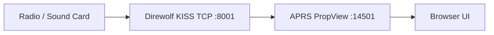

# Docker and App Registry Installs

APRS PropView can run as a container with all writable state in one persistent
data directory. This is the recommended path for TrueNAS SCALE, Portainer,
Unraid, CasaOS, ZimaOS, and other app-registry style systems.

## Quick Start

```bash
docker compose up -d
```

Open `http://localhost:14501`.

The default compose file stores persistent data in `./data`:

- `config.toml`
- `propview.db`
- `map_tile_cache/`
- `user_audio/`

Back up that directory to preserve the full install.

## Image

Published release images are intended to use:

```text
ghcr.io/rf-yvy/aprs-propview:latest
ghcr.io/rf-yvy/aprs-propview:<version>
```

The image exposes port `14501` and includes a Docker health check against
`/api/health`.

## Environment Variables

These variables are useful for containers and app registries:

| Variable | Default | Purpose |
| --- | --- | --- |
| `PROPVIEW_DATA_DIR` | `/data` in Docker | Base directory for persistent state. |
| `PROPVIEW_CONFIG` | `$PROPVIEW_DATA_DIR/config.toml` | Exact config file path. |
| `PROPVIEW_DB` | `$PROPVIEW_DATA_DIR/propview.db` | Exact SQLite database path. |
| `PROPVIEW_HOST` | `0.0.0.0` in Docker | Web bind host. |
| `PROPVIEW_PORT` | `14501` | Web bind port. |
| `PROPVIEW_LAUNCH_BROWSER` | empty | Keep empty in containers. |
| `PROPVIEW_UPDATE_CHECKS` | config value | Set `false` to disable release checks. |
| `PROPVIEW_APRS_IS_ENABLED` | config value | Set `false` for RF-only/offline container starts. |
| `PROPVIEW_KISS_TCP_ENABLED` | config value | Enable the legacy KISS TCP input at startup. |
| `PROPVIEW_KISS_TCP_HOST` | config value | KISS TCP host, commonly `direwolf` in Compose. |
| `PROPVIEW_KISS_TCP_PORT` | config value | KISS TCP port, commonly `8001`. |
| `PROPVIEW_CALLSIGN` | config value | Override station callsign for first-run containers. |
| `PROPVIEW_SSID` | config value | Override station SSID, 0-15. |
| `PROPVIEW_LATITUDE` | config value | Override station latitude. |
| `PROPVIEW_LONGITUDE` | config value | Override station longitude. |
| `PROPVIEW_MAP_TILE_CACHE_DIR` | `$PROPVIEW_DATA_DIR/map_tile_cache` | Override map tile cache location. |
| `PROPVIEW_USER_AUDIO_DIR` | `$PROPVIEW_DATA_DIR/user_audio` | Override alert audio upload location. |

## RF Input

For containers, TCP KISS is the smoothest setup. A common pattern is Direwolf on
the host or another container, with PropView configured for KISS TCP.

Example RF port settings in the PropView web UI:

- Type: `TCP`
- Host: the Direwolf host or container name
- Port: `8001`
- Protocol: `KISS`

If PropView and Direwolf are in the same compose project, use the service name
as the host, for example `direwolf`.

A reference Compose pattern is included at
`deploy/docker/docker-compose.direwolf.yml`. If your Direwolf image or config
layout differs, keep the PropView environment values and adjust only the
Direwolf service.



## USB Serial TNCs

Serial passthrough works, but it depends on the host OS and device permissions.
For Docker Compose:

```yaml
services:
  aprs-propview:
    image: ghcr.io/rf-yvy/aprs-propview:latest
    devices:
      - /dev/ttyUSB0:/dev/ttyUSB0
```

Then configure the RF serial port in PropView as `/dev/ttyUSB0`.

## TrueNAS SCALE Custom App

In TrueNAS SCALE, create a Custom App with:

| Setting | Value |
| --- | --- |
| Image repository | `ghcr.io/rf-yvy/aprs-propview` |
| Image tag | `latest` or a release version |
| Container port | `14501` |
| Published port | `14501` |
| Storage mount | host path such as `/mnt/tank/apps/aprs-propview/data` to `/data` |
| Environment | `PROPVIEW_DATA_DIR=/data`, `PROPVIEW_HOST=0.0.0.0`, `PROPVIEW_PORT=14501`, `PROPVIEW_LAUNCH_BROWSER=` |

A reference values file is included at
`deploy/docker/truenas-scale-custom-app.yaml`.

For TrueNAS, TCP KISS is strongly recommended. Run Direwolf on the host, another
container, or another machine on the LAN, then point PropView at that TCP KISS
endpoint.

## Updating

```bash
docker compose pull
docker compose up -d
```

The container image can be replaced safely as long as `/data` is preserved.

## Portainer Stack

Use the repository `docker-compose.yml`, import
`deploy/docker/portainer-stack.yml`, or paste this stack:

```yaml
services:
  aprs-propview:
    image: ghcr.io/rf-yvy/aprs-propview:latest
    restart: unless-stopped
    ports:
      - "14501:14501"
    environment:
      PROPVIEW_DATA_DIR: /data
      PROPVIEW_HOST: 0.0.0.0
      PROPVIEW_PORT: 14501
      PROPVIEW_LAUNCH_BROWSER: ""
    volumes:
      - aprs-propview-data:/data

volumes:
  aprs-propview-data:
```

## Unraid

A starter Unraid template is included at `deploy/docker/unraid-template.xml`.
Map `/data` to an appdata path and use TCP KISS for the cleanest RF input.
